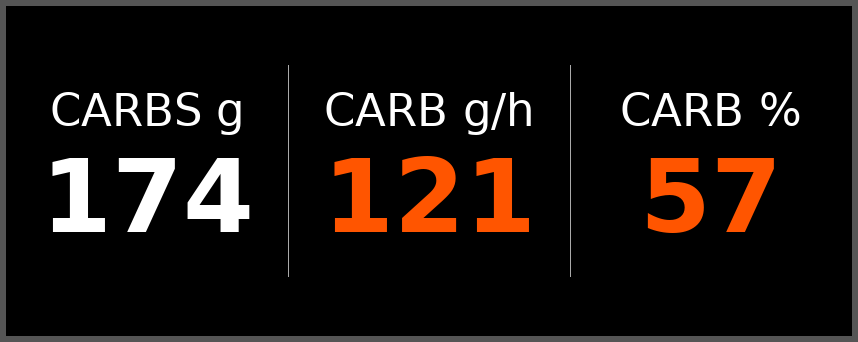
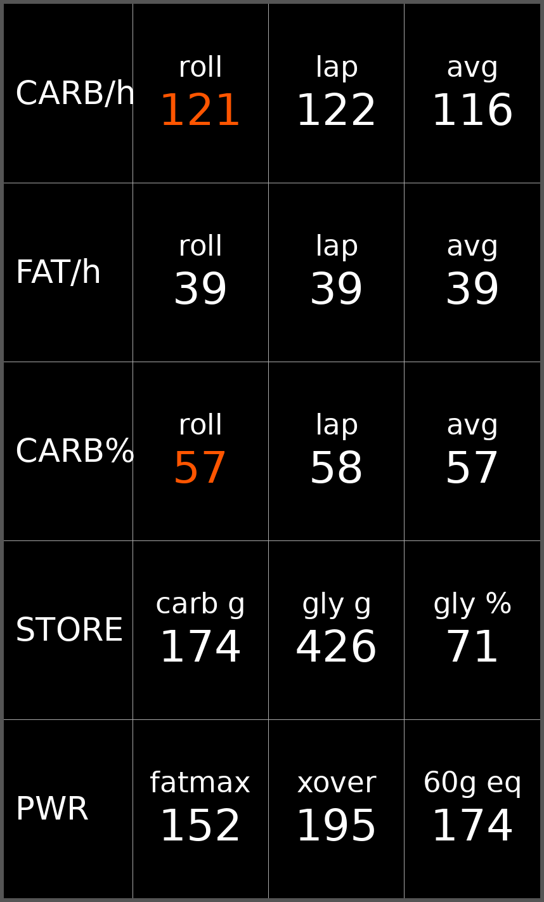

# Carb Burn — Garmin Connect IQ Data Field

A cycling data field that estimates **carbohydrate (CHO) oxidation** live from power,
using your **FTP** and (optionally) **LT1 / aerobic threshold**.

The layout adapts to the field's shape:

- **Wide, short field** — the three core readouts side by side: **CARBS g** (total),
  **CARB g/h** and **CARB %**. The rate and the % are both *rolling* (smoothed on the
  same interval), so they rise and fall together.
- **In-between field** — a short vertical stack of the same values, plus **GLYCG %**
  (glycogen used) when body weight is set.
- **Full screen** — a grid showing, for **carb g/h**, **fat g/h** and **carb %**, the
  **rolling / lap-average / overall-average**; plus **carbs spent**, **glycogen left**
  (g and %), and three key wattages: **fat-max**, the **50% crossover**, and the
  **fueling-equilibrium** power (where carb burn matches your carb intake — below it
  you spare glycogen, above it you deplete).

### What it looks like

Simulated screenshots (generated by `tools/simulate_fields.py`, which replays a
90-minute ride — warm-up, endurance, 4×3-min VO2 intervals, then tempo — through
the exact model and layout code, for the sample rider below). The snapshot is
taken at ~204 W rolling power, so the rolling readouts are orange (between the
50%- and 90%-carb powers):

**Small (wide) field** — the three core readouts side by side:



**Large (full-screen) field** — the rolling / lap / average grid plus stores
and key wattages:



### Colour zones

The rolling **carb g/h** and **carb %** are colour-coded so the numbers double as
a pacing cue. The colour is derived from the *same rolling values the field
displays* (the rolling carb % and rolling fat g/h), so it always matches the
numbers on screen — there is no separate smoothing to lag behind:

- **grey** — below the fat-max band
- **blue** — the fat-max band: rolling fat oxidation within 5% of its modelled
  peak g/h (i.e. you're burning fat at close to your maximum rate)
- **green** — above the fat-max band, up to 50% rolling carb energy
- **orange** — 50–90% rolling carb energy
- **red** — ≥90% rolling carb energy (carbohydrate almost entirely dominant)

On light backgrounds the darker blue/green variants are used so the coloured
numbers stay readable. All boundaries are derived from your own thresholds, so
they scale per rider. For the generic sample rider (FTP 250 W, LT1 175 W) they
correspond to steady-state powers of roughly:

| Zone | Steady power | Colour |
|---|---|---|
| Below the fat-max band | < 130 W | grey |
| Fat-max band (fat g/h ≥ 95% of peak) | 130–173 W | blue |
| Band top → 50%-carb crossover | 173–195 W | green |
| 50%-carb → 90%-carb | 195–265 W | orange |
| Above 90%-carb | > 265 W | red |

Because the 90%-carb level usually needs a power above FTP, **red only appears
during hard efforts above threshold.** The rolling (smoothed) values drive the
colour, so it transitions cleanly rather than flickering on surges.

### FIT recording

The rolling **carbohydrate rate** and **fat rate** (`carb_rate` / `fat_rate`,
g/h) are written into the activity's `.FIT` file as per-record fields — a
graphable time series that rises and falls with intensity — and the cumulative
totals (`total_carbohydrates` / `total_fat`, g) as session fields, so both are
available in Garmin Connect and analysis tools (e.g. intervals.icu custom
fields/streams) after the ride. This uses the `FitContributor` permission.

## How it works

1. **Power → metabolic energy.** `metabolic_watts = power / gross_efficiency`.
   Multiplying mechanical work by an (ideally individualized) gross efficiency is a
   validated way to estimate energy expenditure from a power meter.
2. **% CHO from power.** A logistic *crossover* curve anchored to your thresholds —
   about **35% CHO at LT1** and **85% CHO at FTP** — because fuel selection tracks
   relative intensity in a predictable way. Below LT1 you burn mostly fat; between
   LT1 and FTP the CHO share rises through the crossover; at/above FTP it is
   CHO-dominant.
3. **Grams.** Cumulative CHO kcal ÷ 4.0 kcal/g.

The %CHO fraction is applied *instantaneously* each second (so surges above FTP are
counted as more carb-heavy), then integrated over the ride.

### The model, illustrated

The charts below use a generic sample rider (FTP 250 W, LT1 175 W estimated, GE 21%).

**Energy share by power** — the carbohydrate/fat split. Carbs cross 50% of energy
at the crossover point (~195 W here), between LT1 and FTP:


**Grams per hour by power** — the same model in absolute mass. Note that fat grams
peak in the moderate domain and then fall, while carbs climb steeply; by
mass the two fuels are equal at a *lower* power (~170 W) than the 50%-energy crossover,
because fat carries 9 kcal/g vs 4 kcal/g for carbohydrate:


A full derivation with citations is in **CarbBurn_WhitePaper.pdf**.

### If you have no LT1 test
Leave the **LT1** setting at `0`. The field estimates `LT1 ≈ 0.70 × FTP` and uses the
same curve, so it still works with FTP alone.

### About body weight
The power-based carb model **does not need your weight** — energy comes from
power ÷ gross efficiency. Weight is used for two secondary things:

1. **Garmin calorie cross-check.** Garmin's own cumulative calorie figure
   (`Activity.Info.calories`) is computed from your weight. When it's available the
   field rescales the *magnitude* of the carb numbers to agree with it — the
   carbohydrate/fat **split** always stays from the power model; only the total
   energy is reconciled. Set the weight here to match your Garmin user profile.
2. **Glycogen-store %.** Total body glycogen scales with body mass (~8 g/kg), so
   weight lets the field show carbs burned as a share of your stores.

Set weight to `0` to disable the glycogen readout.

## Settings (edit in Garmin Connect Mobile → the field's settings)

| Setting | Meaning | Default |
|---|---|---|
| FTP (watts) | Functional Threshold Power — required | 250 |
| LT1 / aerobic threshold (watts) | 0 = not tested (estimated from FTP) | 0 |
| Gross efficiency (%) | Trained cyclists ~19–24% | 21 |
| Body weight (kg) | Match your Garmin profile; 0 = disable glycogen readout | 75 |
| Carb intake (g/h) | Assumed carbohydrate intake — sets the fueling-equilibrium power | 60 |

## Build / install

1. Install the **Connect IQ SDK Manager**, the **VS Code Monkey C extension**, and a
   **JDK** (see the setup notes from earlier).
2. Open this folder in VS Code.
3. The manifest ships with a real 32-char hex GUID. If you fork this project and
   publish your own build, replace the `id="..."` in `manifest.xml` with your own
   GUID so the two apps don't collide.
4. Generate a developer key if you don't have one: **Monkey C: Generate a Developer Key**.
5. **Monkey C: Build for Device** → produces a `.prg`. Copy it to
   `GARMIN/APPS/` on your device over USB, or run in the simulator
   (**Monkey C: Run App**, then Simulation → Data Fields).
6. On the device: add **Carb Burn** to a ride data screen. Give it a full-screen or
   half-screen slot so both numbers fit.

## Accuracy / caveats

This is a **population-calibrated estimate**, not a measurement. The fat↔CHO split
varies a lot between individuals with diet (esp. low-carb adaptation), training status,
sex, and body composition. For personal accuracy you'd calibrate gross efficiency and
the crossover anchors against a lab metabolic (RER) test. The two anchor percentages
live in `loadSettings()` in `source/CarbBurnView.mc` if you want to tune them.

## Files

```
manifest.xml                         app manifest (type = datafield)
monkey.jungle                        build config
source/CarbBurnApp.mc                app entry point
source/CarbBurnView.mc               the data field + physiology model
resources/settings/properties.xml    default setting values
resources/settings/settings.xml      Connect Mobile settings UI
resources/strings/strings.xml        display strings
resources/drawables/drawables.xml    launcher icon reference
resources/drawables/launcher_icon.png
CarbBurn_WhitePaper.pdf              technical white paper (derivation + citations)
carb_curve.png                       Figure 1 — energy share vs power
grams_curve.png                      Figure 2 — grams/hour vs power
tools/simulate_fields.py             renders the simulated field screenshots
simulated_field_small.png            simulated wide (3-column) field
simulated_field_large.png            simulated full-screen grid field
```

## Author

**Stephen Cieply, PhD** — [@Macrophage87](https://github.com/Macrophage87)

Developed with assistance from Claude (Anthropic, Opus 4.8).

## License

Copyright © 2026 Stephen Cieply, PhD.

Released under the **MIT License** — you may use, copy, modify, and distribute this
software freely, including commercially, provided the copyright and permission notice
are retained. See [LICENSE](LICENSE) for the full text.
