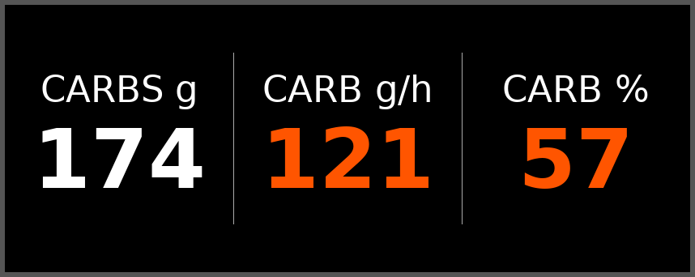
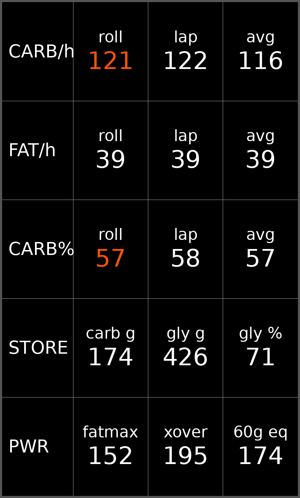
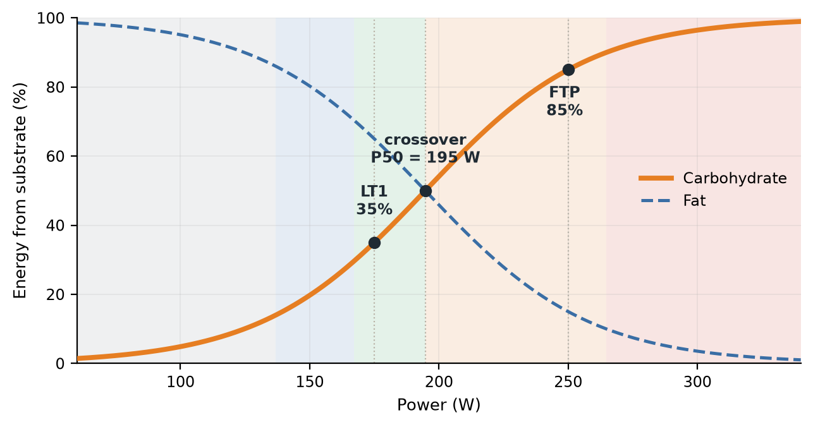
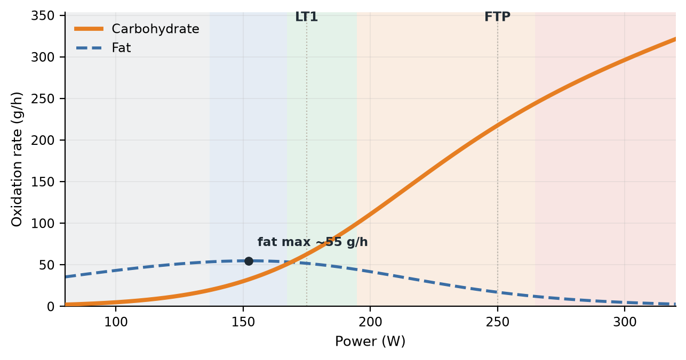
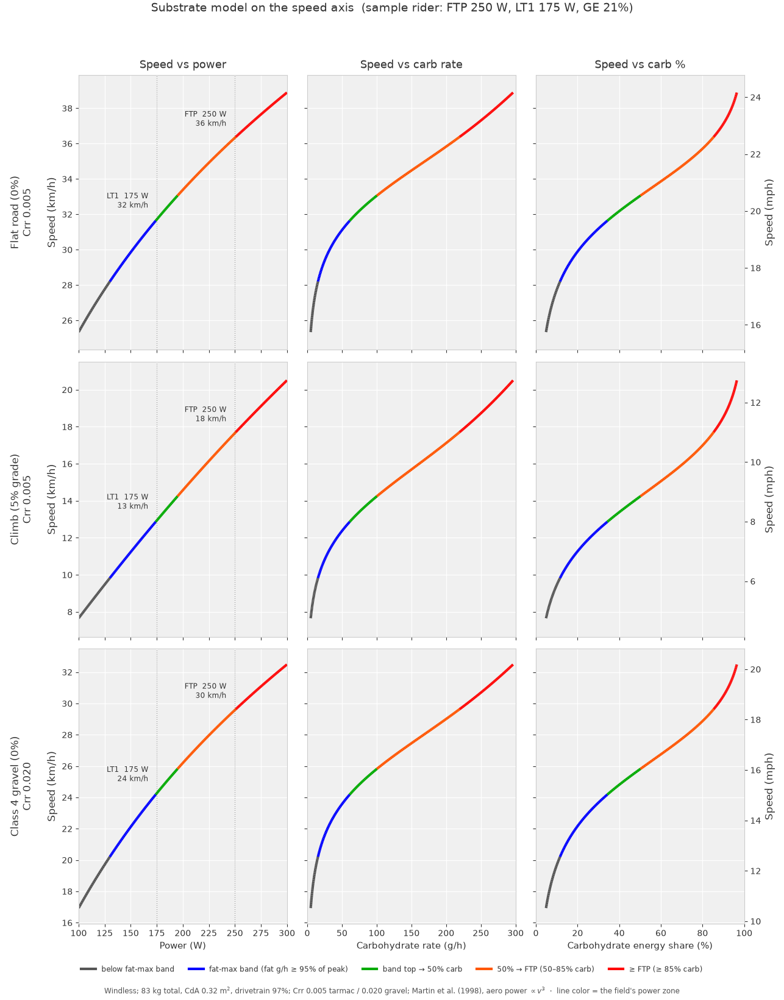

# Carb Burn — Garmin Connect IQ Data Field

A cycling data field that estimates **carbohydrate (CHO) oxidation** live from power,
using your **FTP** and (optionally) **LT1 / aerobic threshold**.

The layout adapts to the field's shape:

- **Wide, short field** — the three core readouts side by side: **CARBS g** (total),
  **CARB g/h** and **CARB %**. The rate and the % are both *rolling* (smoothed on the
  same interval), so they rise and fall together.
- **In-between field** — a short vertical stack of the same values, plus **GLYCG %**
  (glycogen used) when body weight is set.
- **Full screen** — a grid showing, for **carb g/h**, **fat g/h** and **carb %**, the
  **rolling / lap-average / overall-average**; plus **carbs spent**, **glycogen left**
  (g and %), and three key wattages: **fat-max**, the **50% crossover**, and the
  **fueling-equilibrium** power (where carb burn matches your carb intake — below it
  you spare glycogen, above it you deplete).

### What it looks like

Simulated screenshots (generated by `tools/simulate_fields.py`, which replays a
90-minute ride — warm-up, endurance, 4×3-min VO2 intervals, then tempo — through
the exact model and layout code, for the sample rider below). The snapshot is
taken at ~204 W rolling power, so the rolling readouts are orange (between the
50%-carb crossover and FTP):

**Small (wide) field** — the three core readouts side by side:



**Large (full-screen) field** — the rolling / lap / average grid plus stores
and key wattages:



### Color zones

The rolling **carb g/h** and **carb %** are color-coded so the numbers double as a
pacing cue. The color is derived from the *same rolling values the field displays*
(the rolling carb % and rolling fat g/h), so it always matches the numbers on
screen — there's no separate smoothing to lag behind:

- **grey** — below the fat-max band
- **blue** — the fat-max band: rolling fat oxidation within 5% of its modeled peak
  g/h (you're burning fat at close to your maximum rate)
- **green** — above the fat-max band, up to the 50%-carb crossover
- **orange** — 50%-carb crossover up to FTP (50–85% rolling carb energy)
- **red** — at or above FTP (≥85% rolling carb energy; carbohydrate almost entirely dominant)

On light backgrounds the darker blue/green variants are used so the colored numbers
stay readable. All boundaries derive from your own thresholds, so they scale per
rider. For the generic sample rider (FTP 250 W, LT1 175 W) they correspond to
steady-state powers of roughly:

| Zone | Steady power | Color |
|---|---|---|
| Below the fat-max band | < 130 W | grey |
| Fat-max band (fat g/h ≥ 95% of peak) | 130–173 W | blue |
| Band top → 50%-carb crossover | 173–195 W | green |
| 50%-carb → FTP | 195–250 W | orange |
| Above FTP | > 250 W | red |

Red begins at FTP (the model's 85%-carb power), so it flags **efforts above your
one-hour power**. The rolling (smoothed) values drive the color, so it transitions
cleanly rather than flickering on surges.

### FIT recording

The rolling **carbohydrate rate** and **fat rate** (`carb_rate` / `fat_rate`,
g/h) are written into the activity's `.FIT` file as per-record fields — a
graphable time series that rises and falls with intensity — and the cumulative
totals (`total_carbohydrates` / `total_fat`, g) as session fields, so both are
available in Garmin Connect and analysis tools (e.g. intervals.icu custom
fields/streams) after the ride. This uses the `FitContributor` permission.

## How it works

1. **Power → metabolic energy.** `metabolic_watts = power / gross_efficiency`.
   Multiplying mechanical work by an (ideally individualized) gross efficiency is a
   validated way to estimate energy expenditure from a power meter.
2. **% CHO from power.** A logistic *crossover* curve anchored to your thresholds —
   about **35% CHO at LT1** and **85% CHO at FTP** — because fuel selection tracks
   relative intensity in a predictable way. Below LT1 you burn mostly fat; between
   LT1 and FTP the CHO share rises through the crossover; at/above FTP it is
   CHO-dominant.
3. **Grams.** Cumulative CHO kcal ÷ 4.0 kcal/g.

The %CHO fraction is applied *instantaneously* each second (so surges above FTP are
counted as more carb-heavy), then integrated over the ride.

### The model, illustrated

The charts below use a generic sample rider (FTP 250 W, LT1 175 W estimated, GE 21%).
The shaded background bands are the app's pacing color zones (grey → blue → green →
orange → red; see [Color zones](#color-zones) above).

**Energy share by power** — the carbohydrate/fat split. Carbs cross 50% of energy
at the crossover point (~195 W here), between LT1 and FTP:



**Grams per hour by power** — the same model in absolute mass. Note that fat grams
peak in the moderate domain and then fall, while carbs climb steeply; by
mass the two fuels are equal at a *lower* power (~170 W) than the 50%-energy crossover,
because fat carries 9 kcal/g vs 4 kcal/g for carbohydrate:



**Speed, not watts** — the same model on the axis a rider actually watches. Speed
comes from the validated Martin et al. (1998) road-cycling power model (aero power
scales with **v³**), for typical values (83 kg total, CdA 0.32 m², drivetrain 97%,
still air), over the **100–300 W** range you can hold for long rides. The rows are
a **flat road** (Crr 0.005), a **5% climb**, and rough **Class 4 gravel**
(Crr 0.020, ~4× the rolling resistance); each shows speed vs power, speed vs carb
rate, and speed vs carb %, so "carbs at X watts" becomes "carbs at X km/h" (mph on
the right axis). Each row auto-fits its own speed scale, and each curve is colored
by the same power zones the field uses (red begins at FTP):



A full derivation with citations is in **CarbBurn_WhitePaper.pdf**.

### If you have no LT1 test
Leave the **LT1** setting at `0`. The field estimates `LT1 ≈ 0.70 × FTP` and uses the
same curve, so it still works with FTP alone.

### About body weight
The power-based carb model **does not need your weight** — energy comes from
power ÷ gross efficiency. Weight is used for two secondary things:

1. **Garmin calorie cross-check.** Garmin's own cumulative calorie figure
   (`Activity.Info.calories`) is computed from your weight. When it's available the
   field rescales the *magnitude* of the carb numbers to agree with it — the
   carbohydrate/fat **split** always stays from the power model; only the total
   energy is reconciled. Set the weight here to match your Garmin user profile.
2. **Glycogen-store %.** Total body glycogen scales with body mass (~8 g/kg), so
   weight lets the field show carbs burned as a share of your stores.

Set weight to `0` to disable the glycogen readout.

## Settings (edit in Garmin Connect Mobile → the field's settings)

| Setting | Meaning | Default |
|---|---|---|
| FTP (watts) | Functional Threshold Power — required | 250 |
| LT1 / aerobic threshold (watts) | 0 = not tested (estimated from FTP) | 0 |
| Gross efficiency (%) | Trained cyclists ~19–24% | 21 |
| Body weight (kg) | Match your Garmin profile; 0 = disable glycogen readout | 75 |
| Carb intake (g/h) | Assumed carbohydrate intake — sets the fueling-equilibrium power | 60 |

## Build / install

1. Install the **Connect IQ SDK Manager**, the **VS Code Monkey C extension**, and a
   **JDK** (see the setup notes from earlier).
2. Open this folder in VS Code.
3. The manifest ships with a real 32-char hex GUID. If you fork this project and
   publish your own build, replace the `id="..."` in `manifest.xml` with your own
   GUID so the two apps don't collide — **and update `EXPECTED_PRODUCTION_ID` in
   `scripts/check_manifest_appid.py` to match.** That constant pins the upstream
   id, so changing only the manifest fails the `manifest-lint` check. Forking is
   the one legitimate reason to edit both; for upstream, the id must never
   change. (Give the beta variant its own GUID too, in `manifest.beta.xml` — the
   lint also requires every manifest's id to be distinct.)
4. Generate a developer key if you don't have one: **Monkey C: Generate a Developer Key**.
5. **Monkey C: Build for Device** → produces a `.prg`. Copy it to
   `GARMIN/APPS/` on your device over USB, or run in the simulator
   (**Monkey C: Run App**, then Simulation → Data Fields).
6. On the device: add **Carb Burn** to a ride data screen. Give it a full-screen or
   half-screen slot so both numbers fit.
7. **Store release:** run `tools/build_iq.sh` to export a signed
   `dist/CarbBurn-<version>.iq` (it uses your installed SDK and developer key,
   generating a key if you have none), then upload it at
   [apps.garmin.com/developer/upload](https://apps.garmin.com/developer/upload).
   The VS Code equivalent is **Monkey C: Export Project**.

## Beta build — install it *alongside* the production app

`manifest.beta.xml` + `beta.jungle` build the **same source** under a **second
application id** (`3aa0137493fa4511ba559720835b1ab5`, display name
**Carb Burn (Beta)**). Connect IQ identifies an installed app by its application
id, so the beta is a different app: the intent is that it sits next to the store
build instead of replacing it, and that you can put both on one ride screen and
compare them over the same activity.

> **This is scaffolding.** `beta.jungle` changes the manifest and nothing else —
> no source file reads the application id or name, and there is no
> `excludeAnnotations` or source-path override. So a beta built from a given
> commit is **behaviourally identical to a production build from that same
> commit**, and there is no in-tree mechanism for making them differ on purpose
> yet ([#81](https://github.com/Macrophage87/CarbBurnDataField/issues/81)).
>
> That is *not* the same as "identical to what is on your device". Your
> production app is the **published store build**, which lags `main`, so a beta
> sideloaded from a newer `main` can differ from it substantially — the
> comparison is store-release vs current-`main`, not app vs itself. Useful; just
> be clear about which two things you are comparing, and record the commit you
> built the beta from.

The FIT developer field ids stay **0–3**, byte-identical to production
(`source/CarbBurnView.mc`) — nothing is renumbered and no beta-only field is
added. Keeping the schema identical is what a one-activity A/B diff would need.
Whether the two apps are actually attributed separately in the `.FIT` file is a
premise, not a measurement; see "Settings" below.

**The beta id was not registered on the Connect IQ Store by this project. Never
upload it there.**

### Build

```sh
tools/build_beta.sh -y /path/to/developer_key.der
# or:  CIQ_DEVELOPER_KEY=/path/to/developer_key.der  tools/build_beta.sh
```

It produces both artifacts:

| Artifact | Path | For |
|---|---|---|
| package | `dist/beta/CarbBurn-Beta-<version>.iq` | the packaged build |
| per-device | `dist/beta/prg/CarbBurn-Beta-<device>.prg` | direct sideload over USB |

The device list is read out of `manifest.beta.xml` with a real XML parser, so it
is exactly the products that manifest declares (13 today, the same list as
production) regardless of how the file is formatted. That used to be a
line-oriented `sed`, and it was not: of nine reformattings of the same 13
products that `monkeyc` compiles happily, the `sed` returned the right list for
only four, and two of the failures returned a silent *subset* — one of them
built 1 device of 13 and reported `1/1 OK`.

Unlike `tools/build_iq.sh`, this script **never generates a signing key**: pass
one or it exits non-zero. A key you did not choose is a key you cannot
reproduce.

### Sideload

Copy `dist/beta/prg/CarbBurn-Beta-<your-device>.prg` to `GARMIN/APPS/` on the
watch/head-unit over USB, eject, then add **Carb Burn (Beta)** to a ride data
screen.

CI also uploads the same per-device `.prg` set as the `beta-artifacts` artifact.
**If you take the `.prg` from CI rather than building it, confirm the
`beta-build` job concluded green first.** That upload is `if: always()`, so a
*failed* run publishes an artifact too — including one whose application id the
job's own guard rejected, and a beta `.prg` carrying the *production* id would
replace your store install instead of sitting beside it. See "Known asymmetry"
in [docs/ci.md](docs/ci.md) for the mechanism and
[#80](https://github.com/Macrophage87/CarbBurnDataField/issues/80) for the fix.

Once both are on a screen, note that **the two fields look identical while you
ride** — the field draws `CARBS g` / `CARB g/h` / `CARB %` and never its own
name. Only the data-field picker distinguishes them (`Carb Burn` vs
`Carb Burn (Beta)`), so decide which screen position is which before you set
off, and write it down.

### Settings: what is known, and what is not

The two apps are separate installs, so the intent is that each keeps its own
FTP / LT1 / GE / weight / carb-intake values. **That is not verified here, and
one piece of local evidence cuts against assuming it:**

- *Measured (SDK 9.2.0 simulator):* persisted app settings are written to
  `GARMIN/APPS/SETTINGS/<PRG-BASENAME>.SET` — keyed by the **`.prg` file name**,
  and the file contains no application id at all. In the simulator, two builds
  with different ids but the same `.prg` name would therefore share one settings
  blob.
- *Not measured:* how a real device scopes settings between two installed apps,
  and how Garmin Connect Mobile presents two settings pages. No on-device
  observation has been made.

Practical consequence: `tools/build_beta.sh` gives the beta a distinct file name
(`CarbBurn-Beta-<device>.prg`), so keep it distinct when you sideload.

#### Before your first comparison ride: make the settings identical

**Do this, and check it, or the ride tells you nothing.** A freshly sideloaded
beta starts on the defaults in `resources/settings/properties.xml` — **FTP 250,
LT1 0, gross efficiency 21, weight 75, carb intake 60** — while the store app
carries whatever you have configured. Whichever way the scoping question above
resolves, the two ends up with *separate* settings, so the beta will **not**
inherit yours.

Ride both like that and every number differs for settings reasons before any
code difference is visible, which is exactly the confound this variant exists to
remove.

So, in Garmin Connect Mobile, open **both** apps' settings and set all five
values the same:

| Setting | Production | Beta |
|---|---|---|
| FTP (watts) | your value | **same** |
| LT1 / aerobic threshold | your value | **same** |
| Gross efficiency (%) | your value | **same** |
| Body weight (kg) | your value | **same** |
| Carb intake (g/h) | your value | **same** |

Then re-open each page and read the values back before you ride — that costs a
minute and is the difference between a comparison and a coincidence.

#### Separately: the #63 diagnostic

[#63](https://github.com/Macrophage87/CarbBurnDataField/issues/63) asks a
different question — *are* the two settings stores actually independent? Its
protocol deliberately sets the two apps to **different** values and reads them
back, which is the opposite of the setup above.

Run it **on its own, not on a comparison ride**, and set both apps back to
identical values afterwards.

Likewise, whether a decoder actually shows two independently attributed copies
of the developer fields in one `.FIT` file has **not** been observed in this
repo. It is the design premise of this variant, tracked as
[#64](https://github.com/Macrophage87/CarbBurnDataField/issues/64).

## Accuracy / caveats

This is a **population-calibrated estimate**, not a measurement. The fat↔CHO split
varies a lot between individuals with diet (esp. low-carb adaptation), training status,
sex, and body composition. For personal accuracy you'd calibrate gross efficiency and
the crossover anchors against a lab metabolic (RER) test. The two anchor percentages
live in `loadSettings()` in `source/CarbBurnView.mc` if you want to tune them.

## Files

```
manifest.xml                         app manifest (type = datafield)
manifest.beta.xml                    beta variant manifest (separate application id)
monkey.jungle                        build config
beta.jungle                          build config for the beta variant
source/CarbBurnApp.mc                app entry point
source/CarbBurnView.mc               the data field + physiology model
resources/settings/properties.xml    default setting values
resources/settings/settings.xml      Connect Mobile settings UI
resources/strings/strings.xml        display strings
resources/drawables/drawables.xml    launcher icon reference
resources/drawables/launcher_icon.png
CarbBurn_WhitePaper.pdf              technical white paper (derivation + citations)
CHANGELOG.md                         notable changes by release
carb_curve.png                       Figure 1 — energy share vs power
grams_curve.png                      Figure 2 — grams/hour vs power
speed_curves.png                     Figure 3 — speed vs power / carb rate / carb % (flat, climb, gravel)
tools/simulate_fields.py             renders the simulated field screenshots
tools/plot_speed_curves.py           renders the speed-axis white-paper figure
tools/build_iq.sh                    exports a signed .iq for the Connect IQ Store
tools/build_beta.sh                  builds the beta variant (.iq + per-device .prg)
simulated_field_small.png            simulated wide (3-column) field
simulated_field_large.png            simulated full-screen grid field
```

## Author

**Stephen Cieply, PhD** — [@Macrophage87](https://github.com/Macrophage87)

Developed with assistance from Claude (Anthropic, Opus 4.8).

## License

Copyright © 2026 Stephen Cieply, PhD.

Released under the **MIT License** — you may use, copy, modify, and distribute this
software freely, including commercially, provided the copyright and permission notice
are retained. See [LICENSE](LICENSE) for the full text.
